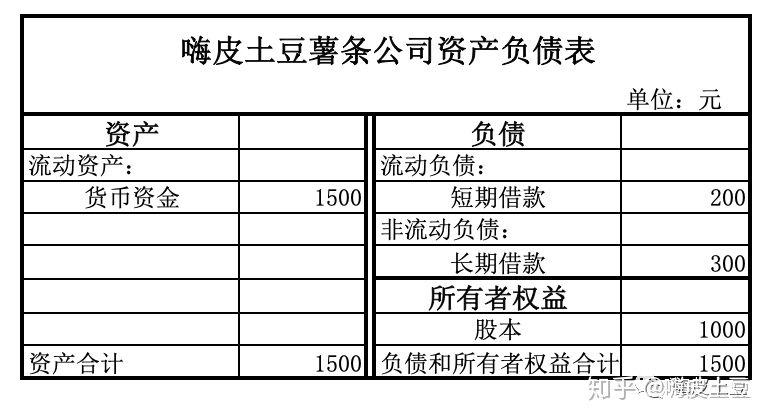
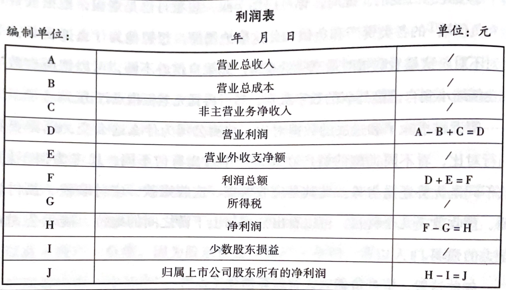

# 财报基础

## 财报阅读入门

财报中，董事会报告和重要事项是必须细读的内容，其次通过 **三张表** 分析企业的经营活动和投资方向，判断董事会是否可信，对市场判断是否准确。另外需要注意 **三张表** 中的 **附注**，企业必须披露但又想隐藏的内容一般在此位置。

### 时间

按规定，上市公司需要披露 **一季报** 、 **半年报** 、 **三季报** 、 **年报**，其中年报必须经过会计师事务所审计并出具审计意见。

### 范围

财报包含 [**资产负载表**](##资产负债表) 、 [**利润表**](##利润表) 、 [**现金流量表**](##利润表) （三大表）。每张报表又需要封闭提供 **母公司报表** 与 **合并报表**，合并报表中将母公司与子公司视为“假想企业集团”，将所有投资关系反映在其中。

### 资产负债表

表的右边，记录钱的来源（借的，欠的，股东投入），表的左边，记录钱的去处（来源使用情况）。 **来源去处总额恒等**。

### 利润表

* 母公司与子公司资产 - 负债 - 少数股东权益 = 归母净资产
  * 归母净资产 / 公司总股本 = 每股净资产
* 归属于上市公司股东净利润，即归母净利润（图标J）
  * 归母净利润 / 公司总股本 = 每股净利润
* 股票价格 / 每股净资产 = 市净率
* 股票价格 / 每股收益 = 市盈率

### 现金流量表

描述公司经营活动、投资活动、筹资活动的报表。通常能通过这些活动反应公司的经营状态，投资重点等内容。

## 重要提示

### 会计师意见

财报中中会计师意见能间接反应财报的真实情况，理解其中能较快速分辨出内容，其中 **标准无保留意见的审计报告** 为最真实的状况。

## 财报结构

### 重点阅读内容

* 公司业务概要
* 经营情况讨论与分析
* 重要事项
* 财务报告

次要内容（准备持有股票需一同关注）

* 普通股股份变动及股东情况
* 优先股相关情况
* 董事、监事、高级管理人员和员工情况

# 资产负载表

## 生产类资产

### 固定资产

* 固定资产指房产，设备，运输工具等有形资产
* 固定资产必须折旧
  通过加大固定资产折旧值，损失记录在当年，第二年出售，实现报表扭转盈亏，方式同样适用于其他#不允许转回资产 

  * 在建工程和工程物资，注意工程时间，多年不转可能为 **避免折旧** 或利用工程回流资金 **增加营业收入**
  * 油气资产
  * 无形资产和开发支出（研发支出）- 专利权、商标权、著作权等。费用化财报可靠性高，减少企业税收。资产化能使财报显得更好看。
  * 生产物资 - 指有生命的动植物。
    * 消耗性** - 直接出售而持有
    * 公益性** - 环境保护为目的
    * 生产性** - 为了产出农产品，或提供劳务目的
  **消耗性** 和 **生产性** 需做 [#减值测试](###减值测试)
  * 商誉 - 企业并购活动时与被收购企业的 **公允价值** 产生的差额，在[资产负债表](###资产负债表)中扣除，A用1100万收购B 80%股份，而B [#公允价值](###公允价值) 为1000万，所以差额为`1100 - 1000 * 80% = 300`, 同样需要做 [#减值测试](###减值测试)。

### 减值测试
将资产账面价值减至可变现价值，差额记录为 **资产减值准备**，作为当年费用从利润表扣除。

### 公允价值

* 活跃市场报价
* 市场参照报价
* 会计师事务所自设估值参数模型估值