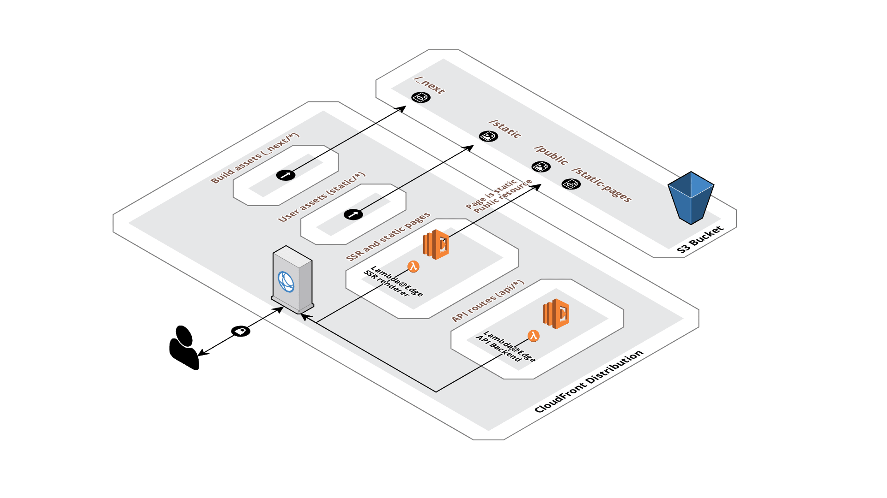

# Nextjs in serverless

使用#serverless部署[#nextjs](https://nextjs.org/)应用需要注意，Nextjs 12.x后构建会默认使用`target: 'serverless'`进行构建，该模式会从原本的**单体应用**变为单个页面对应单个函数的形式，优化了[[how-serverless-function-run#函数生命周期]]中提到的冷启动问题，启动函数时候**无需加载整个应用**。

除此外，因为不能像单体应用一样把缓存写在服务器中，所以我们还要实现**缓存生成**，**缓存校验**，**上传缓存至S3**等功能，这里我们会以[serverless-next.js](https://github.com/serverless-nextjs/serverless-next.js)源码为例，分析如何使用#Serverless部署完整的nextjs应用。以下是官方提供的架构图

* 顶层为**CloudFront**，承载着应用的缓存服务
  * `_next/*` 和 `static/*`的地址转到**S3**中
  * **SSR and static pages lambda**，[处理页面相关逻辑](##处理页面缓存生成)，如缓存生成，请求S3等
  * **api lambda**处理`/api`目录中相关逻辑
* 底层使用**S3**缓存静态数据

## 处理页面请求

这部分代码入口在`@sls-next/lambda/src/handers/default-handler.ts`的`handleRequest`方法中，该方法中处理了三样事情

1. 将lambda event转成nextjs可处理的`req`, `res`
2. 根据**lambda manifets**中的服务器配置创建`aws client`供lambda调用相关服务
3. 调用[`defaultHanlder`](###defaultHandler)处理页面相关逻辑，如`renderReqToHTML`, `getStaticProps`等逻辑

### defaultHandler

改函数位于`@sls-next/core/src/defaultHandler.ts`中，

1. 根据`pageManifest`,`prerenderManifest`,`routesManifest`获取路由逻辑
  1. 判断是否需要渲染页面，需要的话在此步完成
  2. 根据路由方法得到静态文件的获取路径，[缓存生成](##缓存生成)在此步**同步**完成
  3. 判断**lambda function**的权限

## 缓存生成
serverless-next采用是类似**cache-thought**的形式，每次请求对比缓存时间，超过设置时间重新生成缓存。代码在`@sls-next/core/src/defaultHandler.ts@staticRequest`中

1. 从s3中请求资源，判断是否有缓存，有的话判断是否超时，对应执行`regeneration`，往**SQS**中发送消息并等待返回(使用deduplicateID防止重复生成)。
2. 没有缓存判断是否`fallback route`，并且已经静态化，是的话返回html资源
3. 以上都不是则往s3中写入缓存