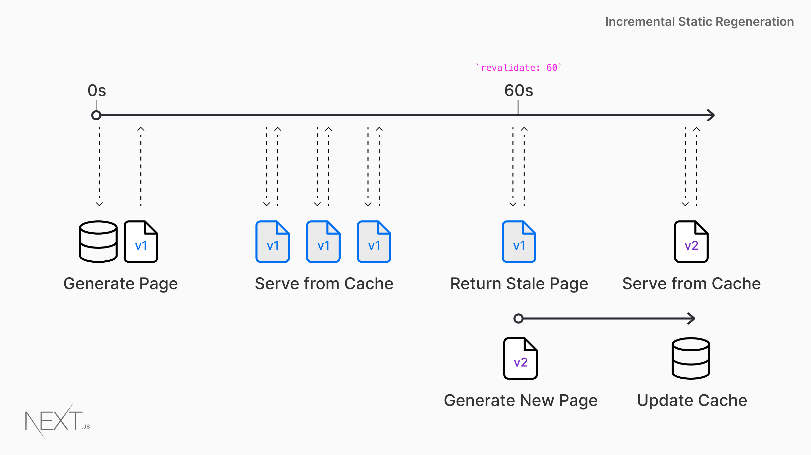

# Nextjs Incremental Static Regeneration

[ISG](https://nextjs.org/docs/basic-features/data-fetching/incremental-static-regeneration)在#nextjs中是个重要的概念，弄懂其中的运行逻辑对处理页面缓存的更新十分重要。ISG能使应用在**运行时生成静态资源**，这可以节省更多的构建时间。或者使A/B测试等逻辑有着更好的性能。

## How to use

在`getStaticPath`中，设置`fallback`为`true`或者`blocking`即可开启，当设置为`true`时，nextjs会运行以下逻辑

1. `getStaticPaths`中返回的路径会在构建时候渲染成`HTML`
2. 当命中路由后，如果内容没有生成不会返回404。相反，nextjs会返回`fallback`版本的页面在第一次请求，即`page`代码中`route.fallback`中的代码
3. 在后台，程序会生成带`getStaticProps`的`HTML`和`JSON`文件.
4. 完成后浏览器会开始请求`JSON`数据，请求成功后会渲染其中的数据
5. 同时#nextjs会把生成的页面保存。下次请求相同路径会直接返回生成的`HTML`

## Fetching Data

分析以下图片，可以知道缓存更新是怎样运行的

1. nextjs设置60s的缓存刷新时间
2. 请求过来后会展示cache的内容
3. CMS中更新内容
4. 到达60s前，都会返回v1的内容
5. 大于等于60s时，请求会返回v1内容，同时后台生成v2的内容
6. 下个请求进来，返回v2的内容，假如更新失败，返回v1内容

## 如何强制更新缓存

结合[How to use](#how-to-use)和[Fetching Data](#fetching-data)，可以得出，删除`JSON`不能更新缓存，删除`HTML`会使下个请求错误，所以可以从下面几点入手去更新缓存

1. 使用页面函数里面的`renderReqToHTML`，重新生成缓存
2. 如果使用[[nextjs-in-serverless]]部署应用的话，可以发送**SQS**指令强制更新缓存
3. 使用`getServerProps`替代`getStaticProps`，然后讲缓存写入工作在服务端进行